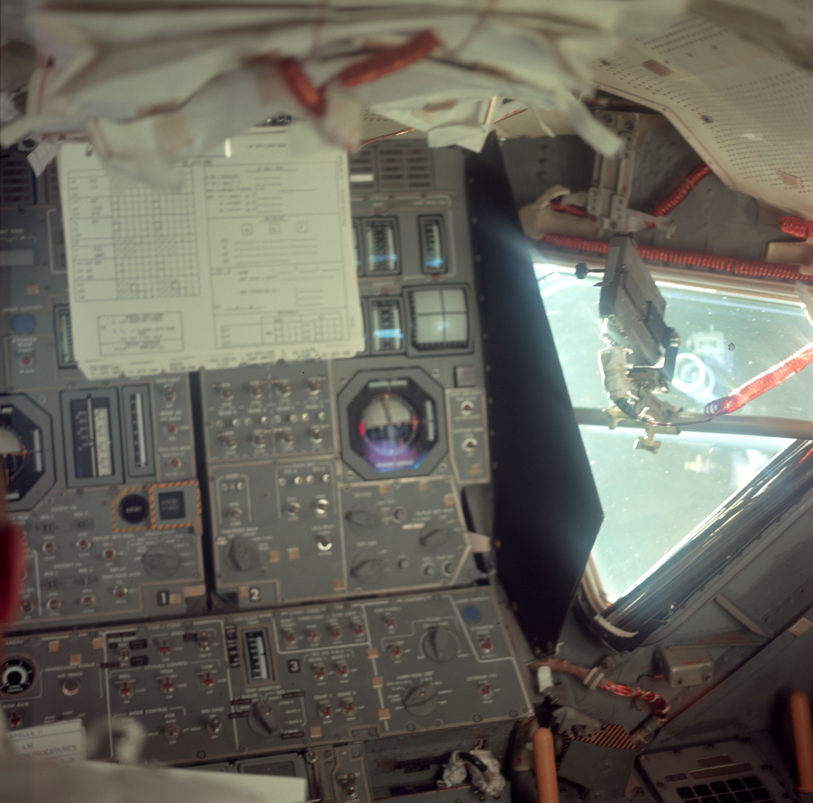
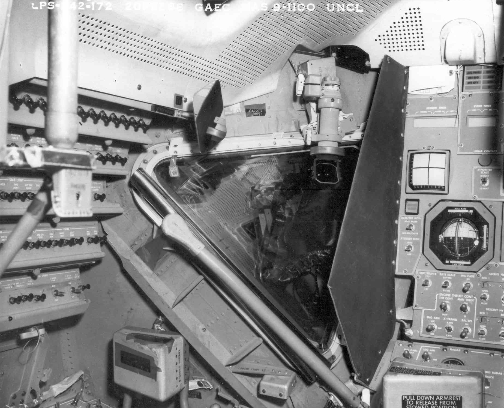

# Lunar module interior photo reference catalog

Research date: 2026-09-08. This is a modeling reference set for an Apollo 11 led cabin with explicitly identified later hardware substitutions. Twelve original downloaded image files have been visually inspected. The machine-readable [download manifest](references/images/manifest.json) records URLs, retrieval failures, byte counts, pixel dimensions, and SHA-256 hashes. Files have not been retouched or upscaled.

## What to use first

Use the control-panel drawing `ad013.gif` to organize panel objects, AS11-36-5389 for Eagle's actual forward-panel appearance, and 69-H-134 for depth around the commander's window. Use 69-H-135 to design separate illuminated legends and instrument faces. It is a monochrome exposure, so it does not establish emission color or brightness. Apollo 16 and 17 closeout frames supply much clearer lower-cabin and ECS detail. Those should be tagged as later references in the Blender file.

Photographic inference below means an observation from the inspected image, followed by a proposed modeling use. It does not establish a measured dimension or a switch function.

## Apollo 11 photographs

The [NASA ALSJ Apollo 11 image library](https://www.nasa.gov/wp-content/uploads/static/history/alsj/a11/images11.html) supplies the archive IDs and captions for these frames. Its migrated image URLs returned HTTP 404 during this research. The [Apollo Journals ALSJ copies](https://apollojournals.org/alsj/a11/images11.html) supplied working images for the first four rows. Preserve both hosts in provenance records.

| ID and local file | Context and provenance | Photographic inference and modeling use | Limits |
|---|---|---|---|
| [69-H-134.jpg](references/images/69-H-134.jpg), 1848 × 1496; [archive image](https://apollojournals.org/alsj/a11/ap11-69-H-134.jpg) | Preflight CDR station; filed January 28, 1969. NASA photograph, scan by Frederic Artner. | Excellent window-frame depth, COAS body and mount, projecting black glare shield, layered breaker rails, fasteners, padded armrest, and perforated ceiling. Model these as separate pieces with visible thickness. | Black and white; partial main panel; perspective and foreground obstruction. The generic original caption alone does not prove every photographed component matches launch-day LM-5. |
| [69-H-135.jpg](references/images/69-H-135.jpg), 1500 × 1864; [archive image](https://apollojournals.org/alsj/a11/ap11-69-H-135.jpg) | ALSJ identifies Eagle's illuminated main panel, filed January 28, 1969. NASA photograph, scan by Frederic Artner. | Strong reference for dividing emission masks among legends, linear scales, instrument faces, and readouts. Most panel material remains dark while markings stand out. | Monochrome and uneven exposure; white instrument faces are partly blown out. Do not derive calibrated light intensity or color. |
| [69-H-136.jpg](references/images/69-H-136.jpg), 1496 × 1856; [archive image](https://apollojournals.org/alsj/a11/ap11-69-H-136.jpg) | Preflight aft cabin; filed January 28, 1969. NASA photograph, scan by Frederic Artner. | Shows hatch ribs and handle geometry, aft mesh and straps, box edges, and ascent-engine cover. Useful for hinge/handle separation and rear visual closure. | Black and white; stowage configuration differs from a fully occupied operational cabin. |
| [AS11-36-5389HR.jpg](references/images/AS11-36-5389HR.jpg), 2340 × 2313; [archive image](https://apollojournals.org/alsj/a11/AS11-36-5389HR.jpg) | Flown Eagle, initial LM inspection around GET 055:41. NASA; scan credit not separately established here. | Main panels 1, 2 and 3, black glare shield, blue circular contact lenses, metal toggles, large rotary pointers, warning border around abort controls, window DAC mounting, red coiled cabling, overhead soft stowage. Best downloaded color frame for the forward interface arrangement. | Soft focus; checklist obscures upper instruments; pale cyan window illumination changes apparent colors. Small labels require handbook confirmation. |
| [AS11-36-5390.jpg](references/images/AS11-36-5390.jpg), 1041 × 833; [NASA-hosted image](https://www.nasa.gov/wp-content/uploads/2023/03/9460194568_b8f0110e97_o.jpg) | Aldrin in flown Eagle. Download comes from [NASA's Aldrin article](https://www.nasa.gov/image-article/astronaut-buzz-aldrin-apollo-11-lunar-module/). | Occupied-cabin reference with control stalk, breaker rows, dark gauge surrounds, instrument-panel relief, and bright window spill. Useful for judging how much interface remains visible near a person. | Portrait framing, shallow focus, strong color cast. Not a suitable label atlas. NASA's article dates it July 20; ALSJ places this frame at the initial inspection near GET 057:03. Preserve that catalog discrepancy. |

An additional primary catalog entry is [NASA JSC's AS11-36-5389 photo record](https://eol.jsc.nasa.gov/SearchPhotos/photo.pl?frame=5389&mission=AS11&roll=36). The [ALSJ inspection mini-pan](https://www.nasa.gov/wp-content/uploads/static/history/alsj/a11/images11.html) combines multiple frames and is a useful discovery lead, but a stitched derivative should not determine exact geometry. Its original frames are better camera-matching references.

## Later mission photographs

[NASA ALSJ's Apollo 11 egress discussion](https://www.nasa.gov/wp-content/uploads/static/history/alsj/a11/a11.step.html) links these later closeout photographs to explain cabin clearances. They show Apollo 16 LM-11 and Apollo 17 LM-12 before launch, not Eagle. NASA-hosted links were broken; the corresponding Apollo Journals files downloaded successfully. Individual scanner credits have not been resolved in this pass, so retain the source page and avoid inventing a credit.

| ID and local file | Verified content | Modeling use and limits |
|---|---|---|
| [LM11-co42.jpg](references/images/LM11-co42.jpg), 2813 × 2800; [archive image](https://apollojournals.org/alsj/a16/LM11-co42.jpg) | Apollo 16 closeout, downward view of floor, forward hatch opening, PLSS, two helmet bags, restraints and side fittings. | Strong reference for floor strips, soft-goods volume, hatch threshold, and the small clearance between stowed gear. Bags conceal much of the floor. Ground-personnel feet beyond the opening are not flight content. |
| [LM11-co43.jpg](references/images/LM11-co43.jpg), 2813 × 2800; [archive image](https://apollojournals.org/alsj/a16/LM11-co43.jpg) | Apollo 16 view through forward hatch toward aft cabin; lower ECS hardware visible at image left. | High-value detail for white sculpted rotary handles, metal fasteners, mesh/grille, fabric hose sleeves, couplings, stowage straps and engine-cover finish. View faces aft, so image-left equipment is on the spacecraft's right side. |
| [LM12-co29.jpg](references/images/LM12-co29.jpg), 2813 × 2715; [archive image](https://apollojournals.org/alsj/a17/LM12-co29.jpg) | Apollo 17 closeout from hatch toward aft cabin, with person above and ECS controls at image left. | A second angle confirms that white ECS knobs project well beyond their beige panel and shows fabric wrapping and hose routing. Use paired with LM11-co43 to understand overlap. Clothing, stowage and lighting obstruct exact depths. |

The closeout filenames are ALSJ identifiers. They have not been mapped to original NASA negative numbers. They can support a documented later-mission substitution; they do not prove that Eagle had identical knob inventory, decals or stowage.

## NASA diagrams for panel organization

[NASA's Apollo drawings page](https://www.nasa.gov/history/diagrams/apollo.html) identifies the publication provenance. The files below are intact original GIF downloads. They are especially useful beside photographs because perspective, people and checklists hide controls in the flight frames.

| File | Publication provenance | Use |
|---|---|---|
| [ad013.gif](references/images/ad013.gif), 3000 × 1523; [NASA original](https://www.nasa.gov/wp-content/uploads/static/history/diagrams/ad013.gif) | Apollo Spacecraft News Reference; page does not establish a mission-specific revision. | Individual panels 1 through 6, 8, 11, 12, 14, 16; DSKY, DEDA, AOT, ORDEAL, hand controllers and utility-light assembly. Start a panel/object inventory here. Enlarged layout is not a dimensioned orthographic drawing of their installation. |
| [ad016.gif](references/images/ad016.gif), 1300 × 852; [NASA original](https://www.nasa.gov/wp-content/uploads/static/history/diagrams/ad016.gif) | 1972 Apollo Program Press Information Notebook, forward cabin. | Relates controls to windows, crash bars, restraints, armrests, lighting and forward hatch. Useful for overall object relationships. Later publication; do not treat as a launch-day Eagle layout. |
| [ad017.gif](references/images/ad017.gif), 1300 × 939; [NASA original](https://www.nasa.gov/wp-content/uploads/static/history/diagrams/ad017.gif) | Same 1972 notebook, aft cabin. | Identifies water/oxygen control modules, overhead hatch, engine cover and equipment storage. Use names to organize meshes and validate which side each assembly occupies. Perspective cutaway is unsuitable for extracting scale. |

## Museum and test-article references

[Smithsonian LM-2, inventory A19711598000](https://airandspace.si.edu/collection-objects/lunar-module-2-apollo/nasm_A19711598000), never flew. Smithsonian says it was modified to resemble Apollo 11's Eagle. Its [interior panorama](https://airandspace.si.edu/multimedia-gallery/panorama/lm-interiorjpg) is a promising spatial reference, but this pass verified only the catalog page, not the interactive panorama imagery. No panorama image was downloaded or inspected. Do not record its controls as flown Apollo 11 hardware.

The collection record labels the object open access, while the panorama page says to contact Smithsonian for rights usage. Treat the panorama's specific media rights separately. For comparison, the museum explicitly marks [NASM2016-03148, Eric Long, July 5, 2016](https://airandspace.si.edu/collection-media/NASM-NASM2016-03148) CC0. That record describes an exterior vehicle view and was not downloaded for the interface set.

[John Uri's NASA LTA-8 test article history](https://www.nasa.gov/history/50-years-ago-on-the-way-to-the-moon-2/) includes a small instrument-panel composite. The saved [chamber8_lta8.jpg](references/images/chamber8_lta8.jpg), 606 × 220, comes from this [NASA original](https://www.nasa.gov/wp-content/uploads/2018/10/chamber8_lta8.jpg). Its right-hand image shows a forward panel and optical assembly. LTA-8 was a thermal-vacuum test article. At this size, use it only to identify a source worth requesting at higher resolution. It cannot support label transcription or exact Eagle configuration.

## Rights and attribution record

NASA's current [image and media guidelines](https://www.nasa.gov/nasa-brand-center/images-and-media/) say NASA content generally is not copyrighted in the United States, with third-party content and other restrictions called out separately. Credit NASA and preserve scan attribution. The [ALSJ image-library notice](https://apollojournals.org/alsj/a16/images16.html) makes a separate copyright claim for its captions while asserting none for NASA photographs. This catalog paraphrases caption facts and adds our own visual observations. It does not package the journal's full captions or derivative panoramas.

The downloaded photographs are research references. A final application should use authored geometry and verified labels. NASA branding and identifiable astronaut photographs need separate attention if used in promotional material. The Smithsonian panorama remains a link-only lead with media rights unresolved.

## Blender reference workflow

These are authoring recommendations, not historical measurements:

1. Put each image on a named reference object and store `source_id`, `source_url`, `vehicle`, `configuration_date`, and `evidence_kind` in custom properties. Use `Apollo11_observed`, `later_mission_reference`, `generic_drawing`, or `test_article` as explicit evidence categories.
2. Match cameras to two or more photographs before fixing panel angles. Diagrams identify parts; they do not remove photographic perspective.
3. Trace readable labels against the appropriate handbook before creating a decal atlas. Do not bake blurred words, film grain, paper checklists, reflections, or photographic illumination into the base material.
4. Separate panel plates, toggle levers, switch guards, rotary knobs, indicator lenses, instrument needles, FDAI ball, and keys into objects that can move or change appearance. Photos help identify their shapes and occlusion; operating manuals must establish their travel and behavior.
5. Keep the 69-H-135 illumination reference beside the color flight frames. Separate base color from emission so cabin floodlights can change independently of backlit legends.
6. Add a review camera for each reference frame. Screenshot the authored cabin through those cameras to compare silhouettes, protrusion and sightlines before USDZ export.

## Remaining image gaps

The current set is enough for a first forward-cabin blockout and component inventory. It does not supply dimensioned, readable closeups of every panel. The next image pass should prioritize panel 4 DSKY key geometry, panel 6 DEDA, panels 11/16 breaker spacing and guards, panels 8/12/14 from side angles, AOT eyepiece controls, and hand-controller bases/pivots. Find original high-resolution negatives for 69-H-134/135/136 and obtain a rights-qualified LM-2 panorama view. Capture each substitution in the model's evidence record instead of silently combining missions.
