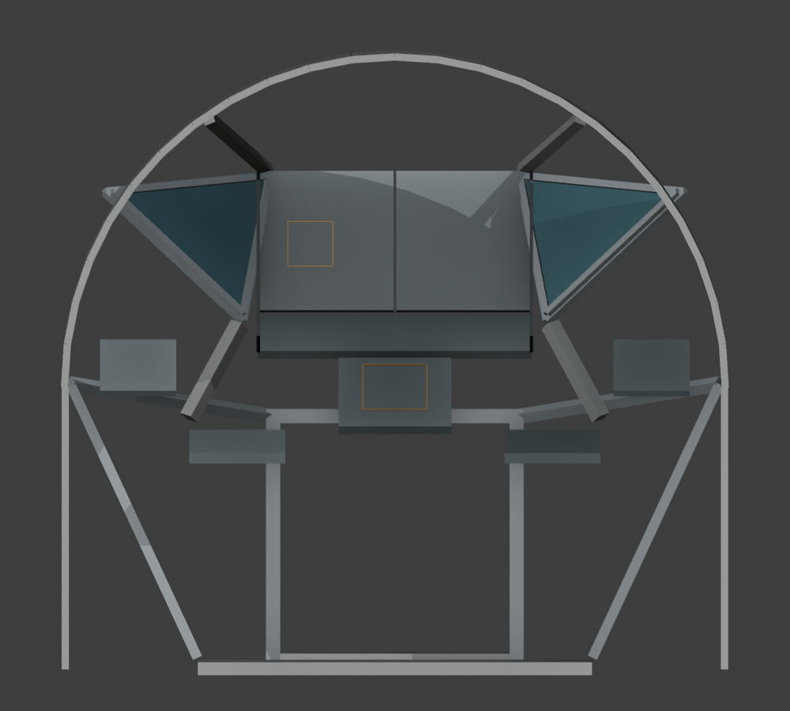
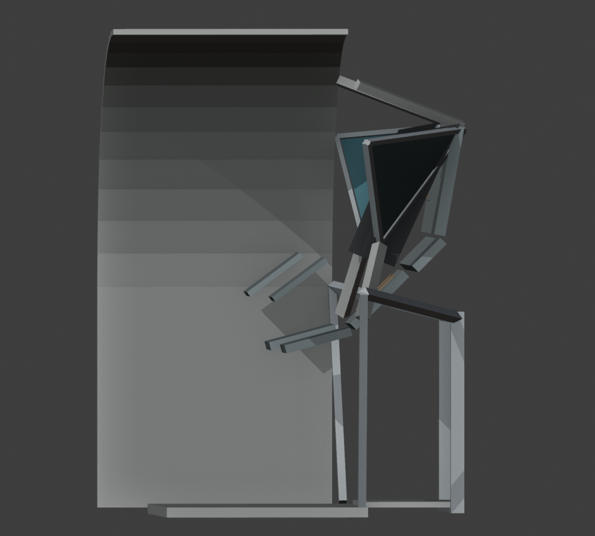
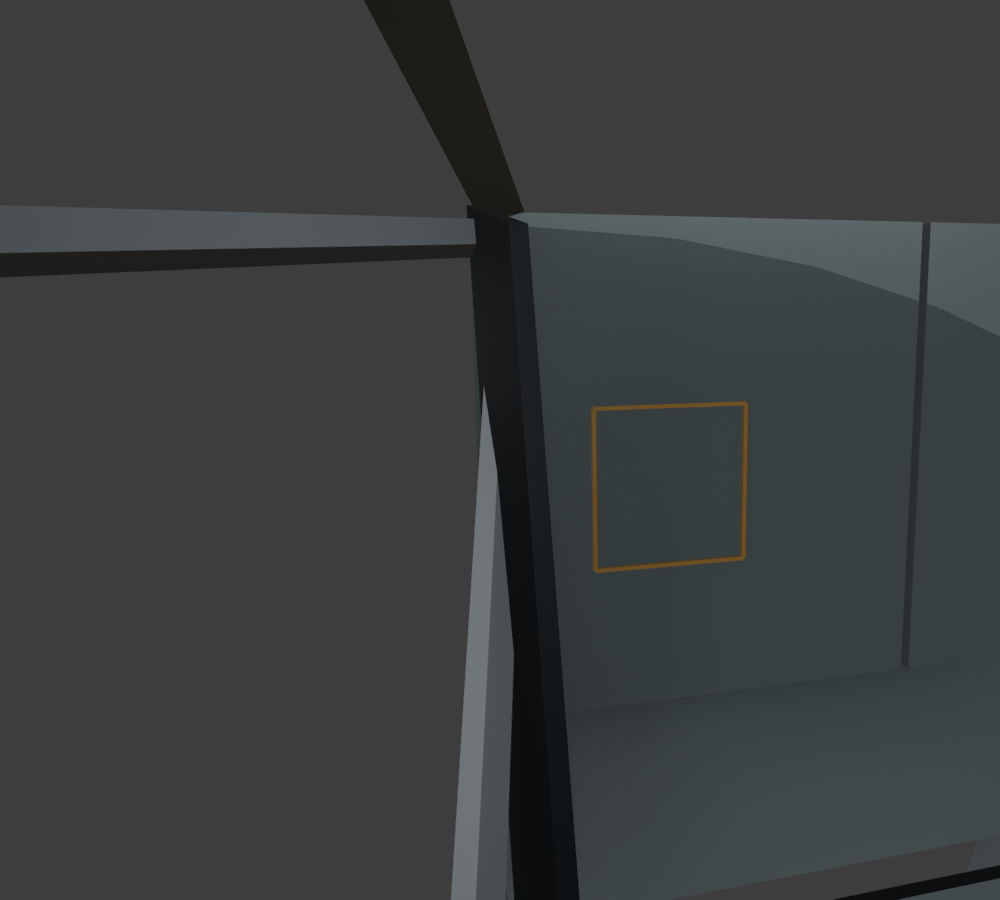

# Cabin interface review

These are 1000 × 900 Workbench previews, not photometric renders. Gray = structure, blue-gray = blank panel reservation, black = glare shield, ochre outline = instrument reservation. No flight instrument is placed. Cameras remain editable in Cabin.blend and are not exported.

Front camera (0,1.25,4), orthographic 2.8 m. Full crown, nominal hatch opening, center panels and both station tiers. Nominal shell diameter 2.3368 m; actual visual width including thickness 2.366739 m. Deck width 1.397 m. Hatch clear straight-sided opening .8128 m; production corner radii unresolved. Panels 1/2 are each .48 × .50 m, provisional. The inner window top side is .7112 m.

Side camera (4,1.25,0), orthographic 2.7 m. Near-side shell skin hidden for review only; far side remains. Forward is image right. Shows -10° main faces, -45° center slope, -75° lower consoles and the oblique windows. Barrel depth is 1.0668 m; whole visual bound spans 1.579464 m in Z including forward closure. This is not a claim that the original 42-inch compartment dimension includes every nose extremity. Forward threshold bridge is .4228 m long and provisional.

Camera origin is exactly CDR_Eye (-.5588,1.78,-.38); target (-.45,1.6,-1.0), 20 mm lens. Pane faces hidden in Workbench only so the aperture is visible; frames remain. Neutral USD has .08 pane opacity; no reflective material qualification. The view shows the CDR window beside the center stack and projecting shield. No rendered grid is claimed: LPD_Inner and LPD_Outer are distinct mounting nodes for app-owned calibrated artwork.

## Installed-photo comparisons performed

| Reference | Observation used | Result / unresolved measurement |
|---|---|---|
| 69-H-134, preflight CDR station | Thick triangular window frame and tall black shield running beside panel, projecting toward crew; side-console tiers have depth | Separate inner/outer frame rails and tall shield replace the legacy shallow plate. Exact profile, frame width and projection are estimates. Photographic perspective prevents dimension extraction. |
| AS11-36-5389HR, flown Eagle | Central stack stands between windows; shield follows stack edge; lower center face slopes down and aft | Window inboard edge constrains proposed forward panel placement. Main cant uses the 1967 text; not measured from this photo. No flattening of the control-layout atlas into an installed plane. |
| LM11-co42, Apollo 16 closeout | Hatch threshold joins forward opening and floor; much of floor obscured by stowage | Provisional threshold bridge added. Later-mission relationship only; no LM-11 equipment, strips, bags or exact hatch radii substituted as LM-5 geometry. |

This is a qualitative silhouette/depth comparison, not a solved camera match or photogrammetry. Image pixels were inspected at source resolution through the viewer; no angle/length was measured from them. Both Apollo 11 photos support tall shields, but do not prove the proposed shield outline. Further camera matching and production drawings are acceptance gates before detailed panels. Controls inventory and flattened drawings supply names/relationships only.

## Reconciliation needed

- Accept or revise forward panel registration and shield profiles before placing detailed panels.
- Inner optical corner rays and 20 mm cavity preserve current app compatibility; they remain reconstructed/provisional historically.
- Barrel/forward closure intersection and full pressure-skin surfacing need engineering evidence. This intentionally open mounting skeleton is not an airtight shell.
- DSKY ochre outline is .226 × .223 m at the proposed display pose, not a slot. Rear clearance/mating plane/cutout remain null.
- FDAI ochre outline is .16 m square, merely a reservation. No unpublished FDAI component has been opened or placed.
- No hatch leaf or actuated hardware is included; mount groups can move independently, but no hinge or travel envelope is inferred.
