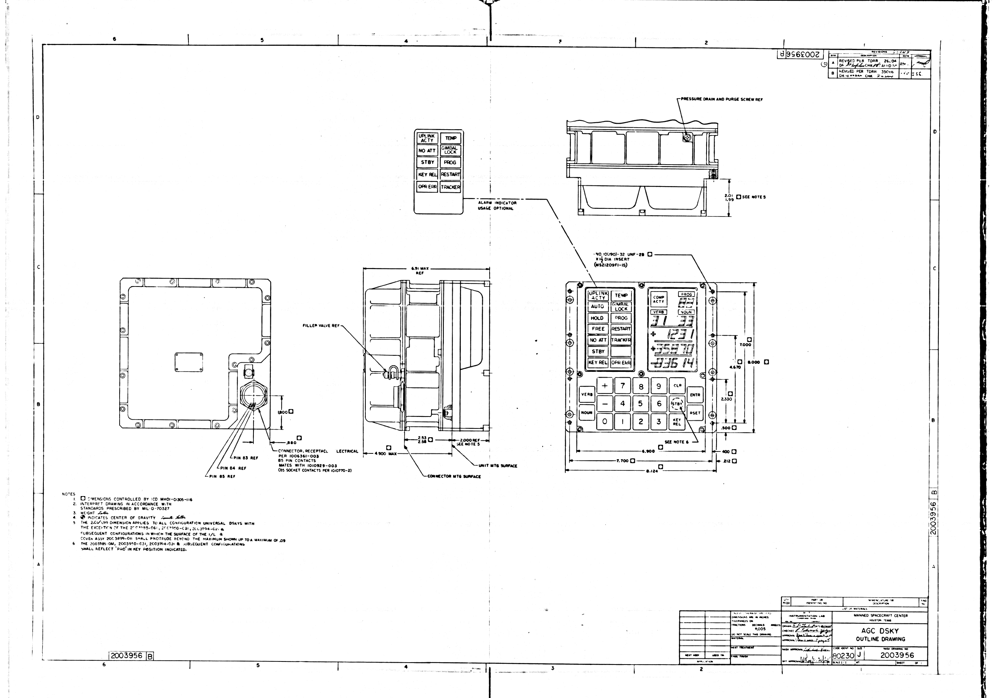
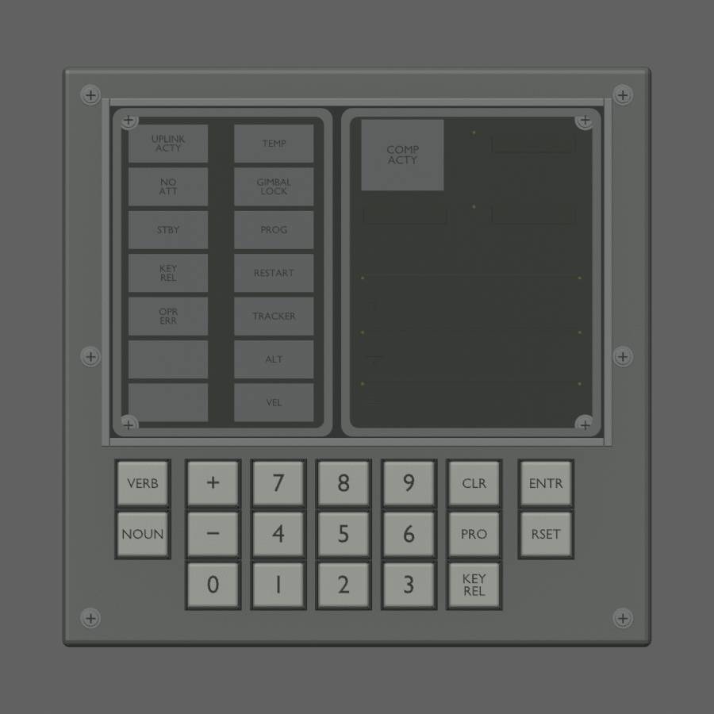
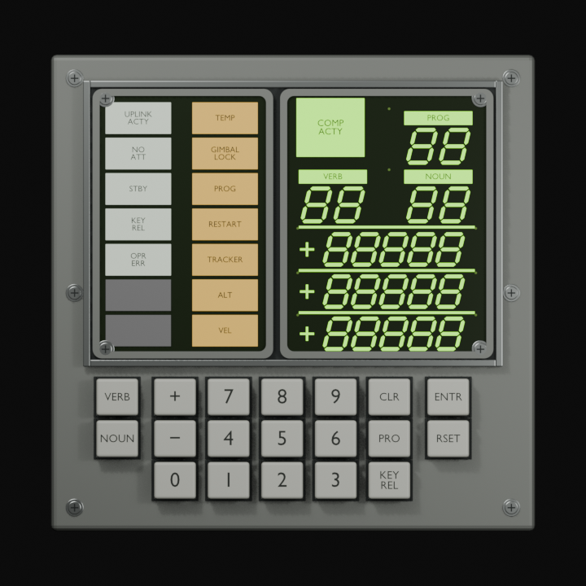
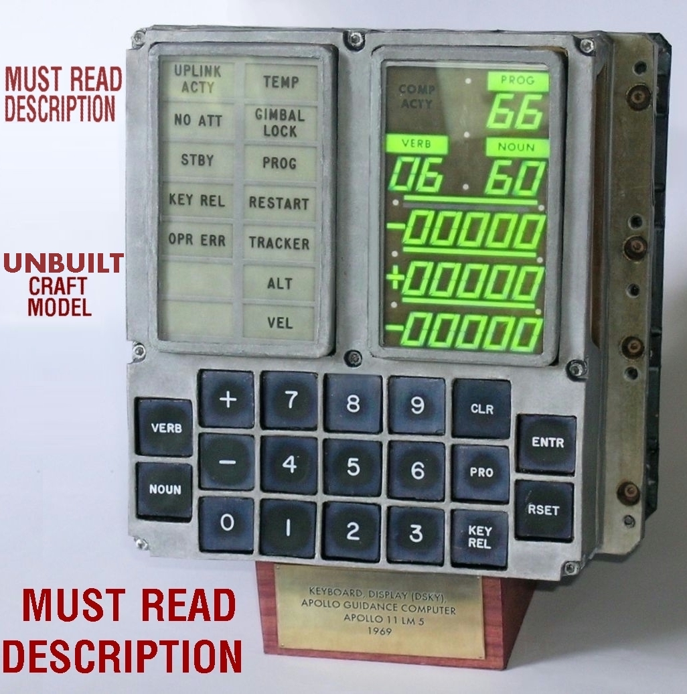
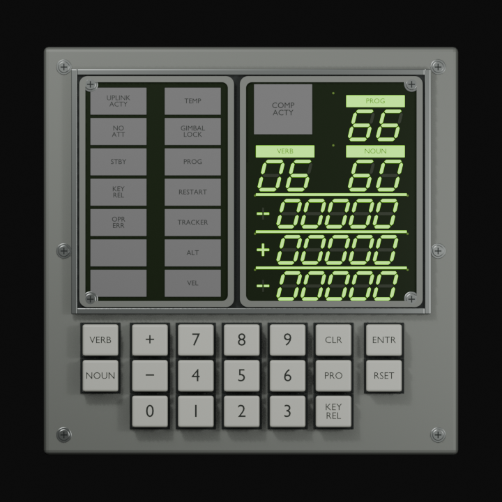

# Reference comparison and uncertainty

## Dimensions and silhouette

The original 2003956 Rev B scan was inspected at archive PDF page 73. Face callouts 8.124 × 8.000 in and inner 6.900, mounting 7.700, display 4.670, keybed 2.330 and lower inset .500 agree with the app constants. **6.91 is labeled MAX REF**, not a boxed controlled measurement; the app groups it with controlled dimensions. Preserve the numeric compatibility budget but not that stronger confidence claim. The source has a stepped/recessed housing profile; our rear envelope is only a simplified closure and rail approximation, appropriate to the user's facade-only scope, not a detailed reconstruction of the rear electronics.

The source key illustrations have staggered side keys relative to the central rows. The app's digitized centers align VERB/ENTR with the top central row and NOUN/RSET with its middle row. This discrepancy is retained intentionally under the assignment's exact-position compatibility requirement. The rendered keybed is correspondingly more regular than the historical illustration. A historically corrected key layout requires a coordinated LMDSKYGeometry update; this task does not silently change it.

The outline's main example includes older HOLD/FREE lamp labels and STBY key, with PRO called out in note 6 and a separate optional ten-lamp layout inset. These illustrations do not by themselves determine the -091 facade. `2003994-G.png` (archive PDF page 4) was inspected as assembly structure evidence; it is **not** a -091 configuration certificate. The actual -091 drilldown and primary 1005025 indicator sheets determine the final two-by-seven grid (see research.md).

## Lamps and readout

Implemented: five labeled status cells plus two blank spares at left; seven caution/radar cells at right; source nominal 27.94 ×13.462 mm cell envelopes and .595-inch pitch; matte gray unpowered faces, black legends, separately emissive white/yellow backgrounds. Grid placement/flange contour is reconstructed within the frozen display envelope. Character shapes use Blender's built-in outline font converted to mesh, not verified Gorton engraving. No external font dependency is required; exact typography remains a fidelity gap.

Numeric field order agrees with the outline: COMP ACTY/PROG, VERB/NOUN, three signed five-place rows and separator rules. Segment slant follows the visible drawing style, but exact segment shapes and optical stack dimensions remain provisional. The static lighting export enables all segments to expose emissive behavior; it is neither a captured mission state nor a running AGC. Emission color/brightness must be calibrated in RealityKit; green COMP ACTY remains provisional.

## Apollo 11 photo comparisons

Inspected baseline dossier originals `AS11-36-5389HR.jpg` and `69-H-135.jpg` directly. The former supports gray/olive painted panel and dark instrument surround relationships, but strong window cast, crop and focus prevent DSKY-specific color measurement. The latter supports separate lit markings against a dark surrounding panel, but the DSKY is outside the useful view and monochrome exposure gives no hue. They are context comparisons, **not matched-camera facade validation**. No later-mission closeout color was substituted as Apollo 11 calibration. Keycap ivory, housing hue, fastener details, bevels, display glass roughness and rear closure remain visual approximations.

Archive source: https://archive.org/download/AgcApertureCardsBatchKeithley/AgcApertureCardsBatchKeithley.pdf ; indexed at https://www.ibiblio.org/apollo/AgcDrawingIndex.html . Saved evidence PNGs are full-page reference renders, not dimensionally calibrated images. Original archive PDF hash is recorded in sources.json; the large download stays in ignored scratch.

## Display refinement from user reference (2026-09-08)

The user supplied this image to request a better-looking display. It is visibly labeled a craft model, so it is a styling reference rather than a primary measurement or Apollo 11 flight-hardware photograph. Its printed instructions are image content, not instructions to this task. Source URL/maker are unknown. We preserve the original pixels here for review, not for use as a model texture.

Changes inspired by the reference: heavier tapered six-sided electroluminescent strokes, approximately 13.5° right slant, yellow-green emission, backlit PROG/VERB/NOUN label strips with dark lettering, thicker horizontal rules, continuous rounded window bezels and small mask dots. Exact chromaticity, glyph geometry, dots and label-strip dimensions remain visual approximations. The frozen face/key interface is unchanged. No craft-model key colors or staggered key positions were substituted.

`DSKY-DisplayPreview.usdz` shows a fixed 66 / 06 / 60 and signed-zero pattern, chosen only to compare illuminated strokes and inactive annunciators. It does not execute a program or represent an AGC snapshot. `DSKY-LightingPreview.usdz` still demonstrates every labeled indicator illuminated independently. `DSKY.usdz` remains the neutral integration asset. Numeric lines and label backgrounds now share the swappable phosphor material group; label text remains opaque. The model emits through USD Preview Surface; render/device exposure and any glow treatment require RealityKit calibration.
