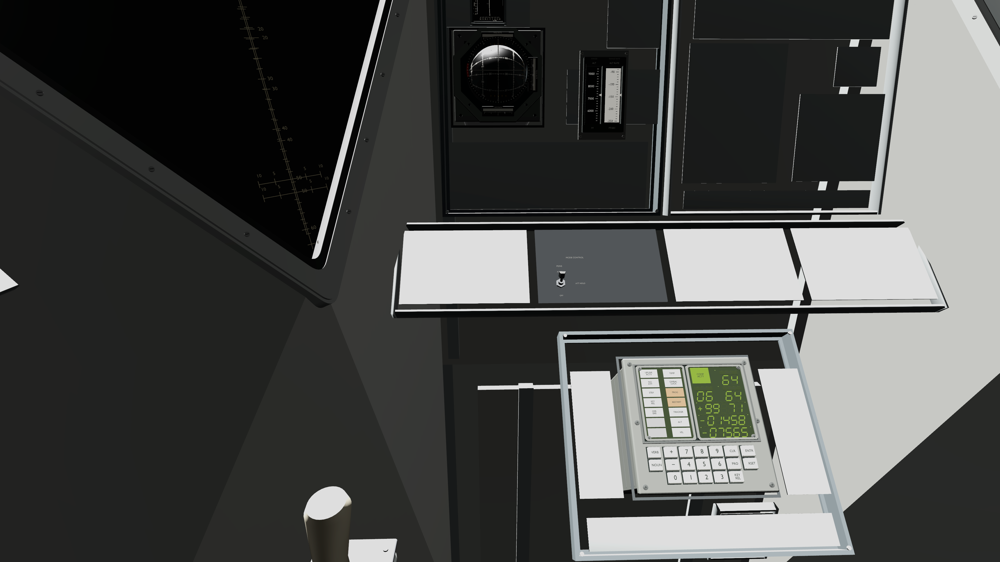
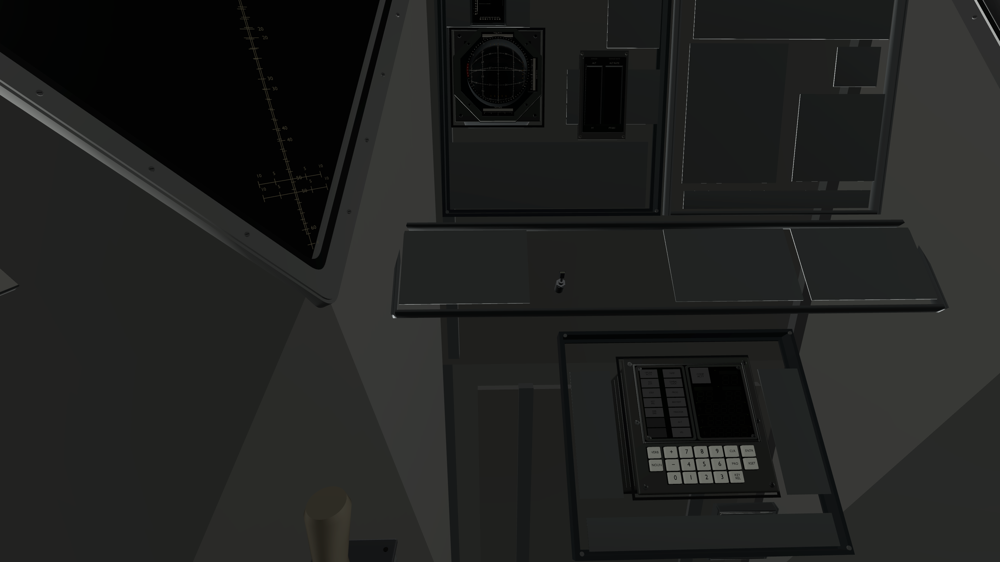
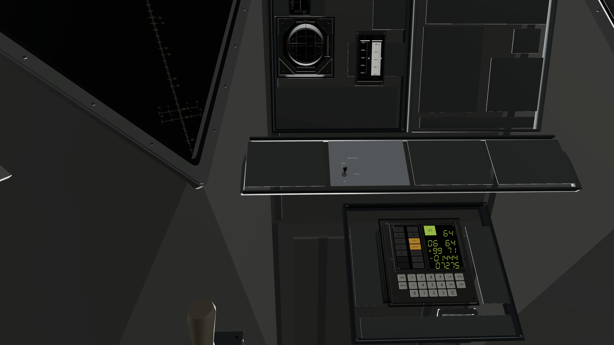
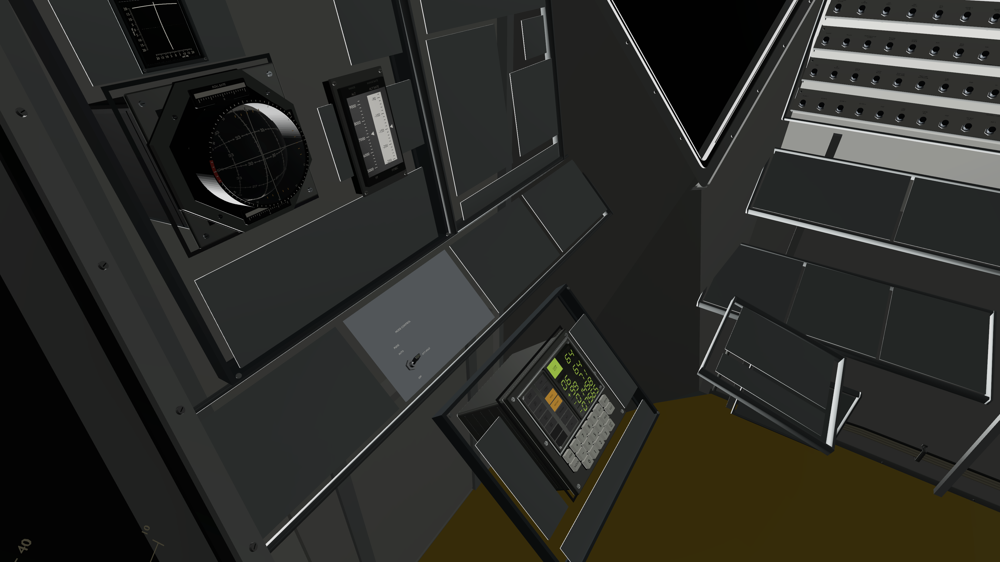
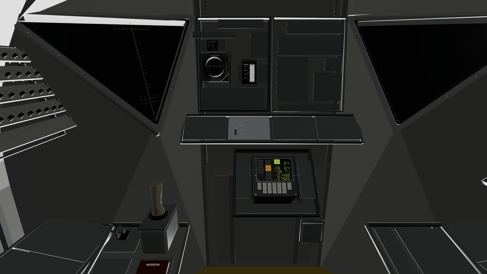
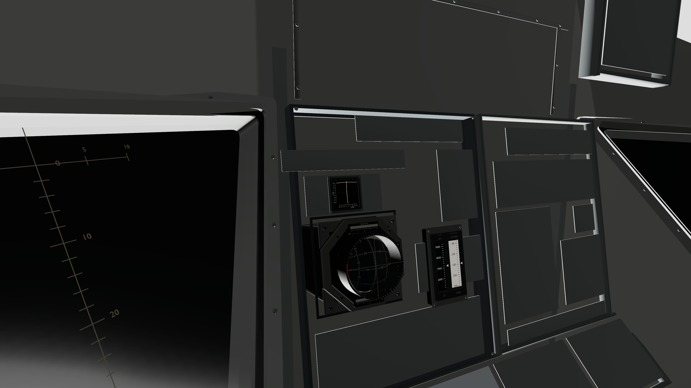
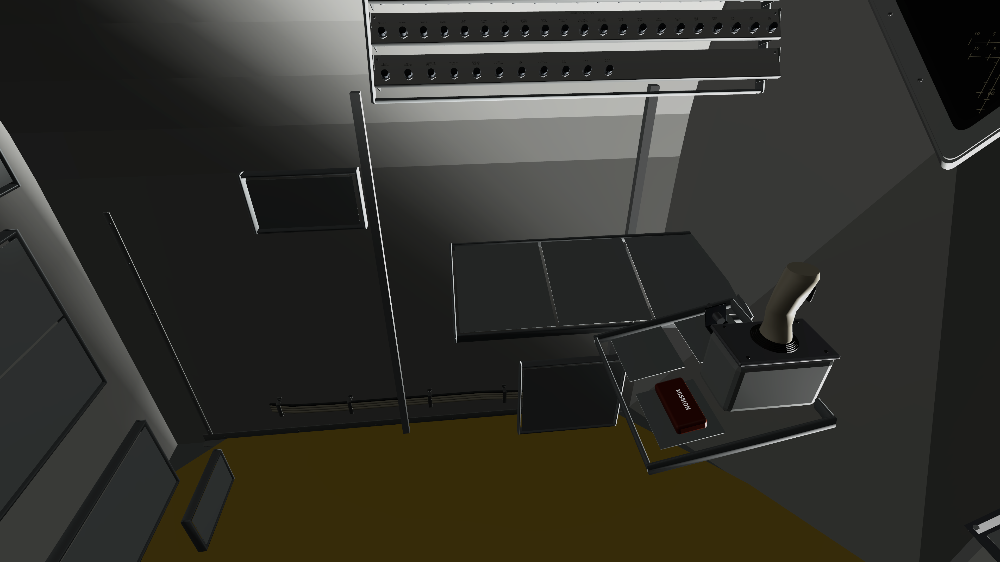

# Commander instruments and startup lighting acceptance

Final source: LM `5ec10b8404130b1b0cefdbdc28d93aa3d221ec4a`; LMKit runtime `1285040`; unchanged AGC/LMCore `b3f1553`. All Swift sources match the isolated build snapshot; hashes and raw result-bundle location are in `source-manifest.json`.

**64 tests in 13 suites passed, zero failures/skips**, on visionOS 26.5 Simulator. See `coordinator-final-summary.json` and `coordinator-final.log`. Coverage includes previous DSKY/FDAI/ACA, foundation, LPD and interaction checks; tape/shutter and cross-pointer behavior; mode/DES RATE lifecycle; transactional optional overlays; initial/prepared mission-light consistency, missing metadata and selected-site pose continuity. Earlier runs remain under the raw evidence directory. The first 64-test candidate had one exact floating-point comparison failure (24999.998 versus 25000); the final test allows less than one lux of rounding difference. Its 63 other cases passed.

## Startup observation

`StartupBefore/` preserves the reproduced bright-at-9s/dark-at-10s transition and baseline patch/timing. A 42,000-lux unshadowed arbitrary sun was replaced by the existing approximately 25,000-lux shadowed mission sun after terrain loading.

`StartupAfter/` records the final same-launch sequence. The 9s image precedes terrain attachment; the 12s image follows it. Launch was 22:17:12.334 UTC; the swap was 22:17:22.785–22:17:22.794 UTC. Both swap logs report one MissionSun, intensity 24999.998, identical world quaternion and shadows enabled. The large cabin washout is absent. Readouts/materials still hydrate during startup, and simulation can change attitude and shadows; this is not identical-frame or physically calibrated photometry. Overall interior illumination remains an art/visibility refinement opportunity.

## Final views

`Final/` retains full-resolution simulator PNGs and exact launch arguments. Commander/front show normal presentation; cross-pointer uses a supplemental camera at the same commander eye aimed at the dial (the usual commander camera clips its top). Detail/no-details, planning, training and procedural fallback are separate comparisons. These views do not certify complete sightlines or mechanical seating.

## Qualification

Four partial functional regions, nine optional breaker regions (160 breakers), and seven removable cable/trim groups are integrated. Existing DSKY, FDAI and ACA remain bound. Breakers/fittings have no electrical semantics. Altitude is geometric height, not radar slant range; cross-pointer polarity/frame is a documented later operational inference. OFF is unsupported. LPD optical calibration, provisional housing fit, physical Vision Pro gaze/pinch/reach and performance remain unqualified. See `../../CommanderLandingInstrumentsHandoff.md` for behavior and sources.

Simulator shutdown completed after final captures; the validation slot is released.
