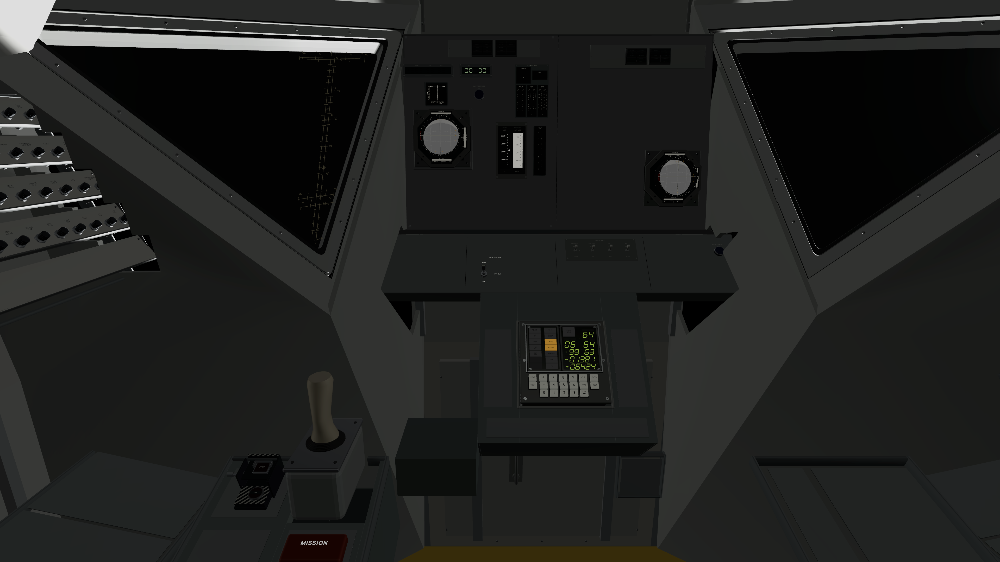
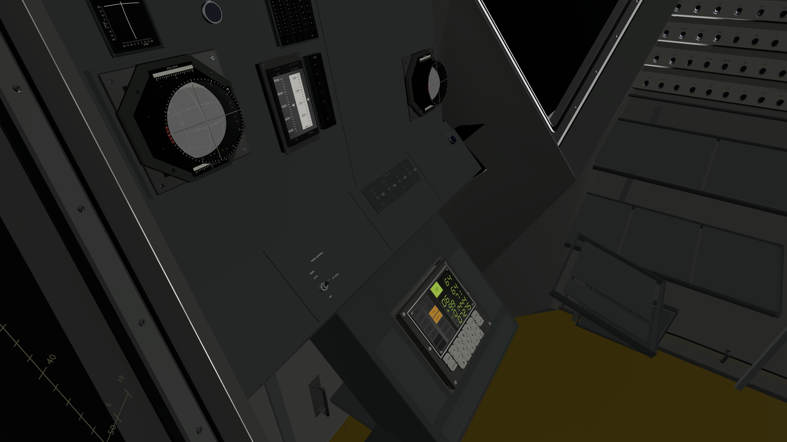
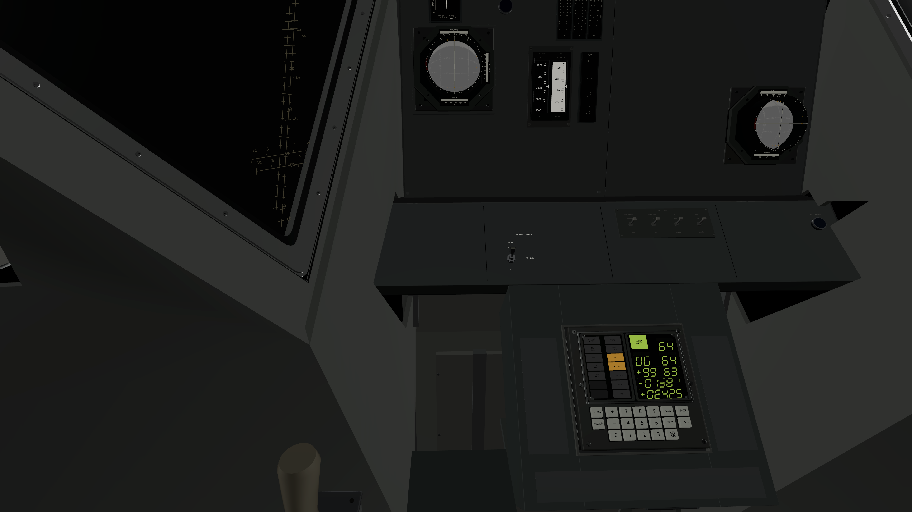
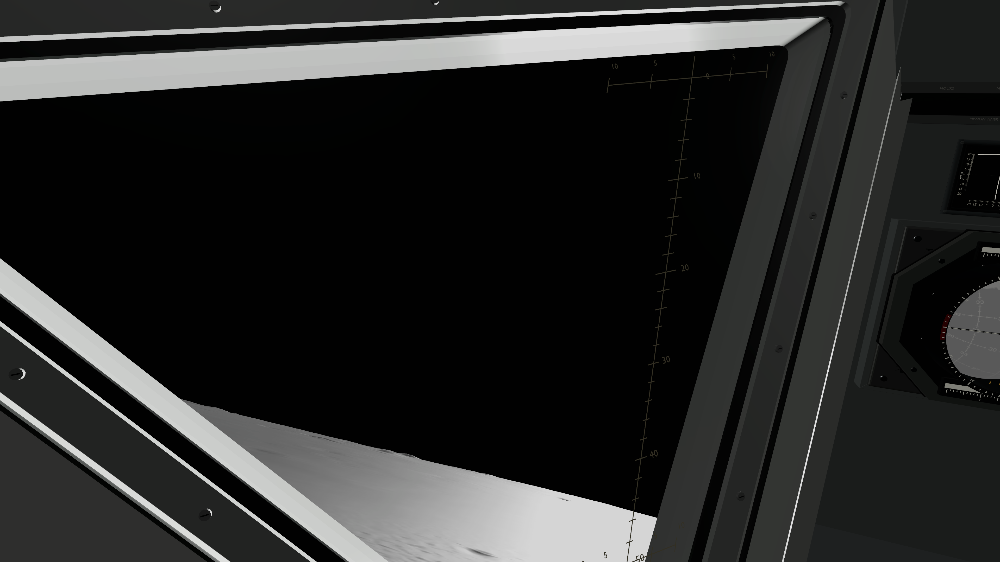

# Solid console and LPD acceptance

The central console now provides continuous faces and enclosed instrument backs around both FDAIs; the lower console seats the existing DSKY in a closed case and encloses the controller area. Broad window surrounds replace narrow structural framing while preserving glass, LPD, mount datums and control clearances. Blank areas remain solid surfaces for future equipment.

LMKit runtime source: `c425dcfc8a753c20159fe2226a181faace96b9dc`. LM runtime source: `0b987686b63b1d92b06c120d29be65a01cfd5c66`. AGC/LMCore unchanged. Asset component commits and combined geometry evidence are recorded in LMKit `Provenance/solid-console-acceptance.json`.

## Behavior and validation

Each optional enclosure validates exact replacement paths and protected full mount transforms before attaching or hiding any old surfaces. Instrument identities, live inputs, planning occupancy and fallback remain intact. New pressure-shell replacement groups participate in fitted local shadows. The runtime requires both live FDAIs before installing the central console and DSKY/ACA before installing the lower console.

Initial native run at `53b9f17` passed 103 of 105 tests; two new enclosure tests exposed exact-unit scale rejection of legitimate `0.99999988` transform decomposition. The fix accepts only finite near-unit enclosure scale within 1e-6, preserves it in the compared matrix, and leaves strict Inventory rules unchanged. Seven focused tests and all 105 tests across 19 suites pass on corrected source, with zero failures or skips. Native front, crew, control-closeup and LPD images were inspected. Solid embedding improved; the pilot-contact surround retains a visible unlined notch. A later lining draft is excluded from this tested package at the user’s request to wrap up.

Package validation passes 13 functions, including two parameterized functions with 17 resource cases each. The independent combined geometry check finds no crossings among the new enclosures or with windows/breaker banks; sampled window, instrument and DSKY rays plus 125 ACA poses clear. Hidden rear mounting contacts and provisional pressure-shell seating remain documented.

## LPD correction

The old scale spine was placed by arbitrary interpolation across the triangular pane, producing changing azimuth with elevation. It now projects the vehicle-forward reference from the unchanged provisional commander eye. Inner/outer artwork alignment is corrected; all 109 non-LPD prim fingerprints remain unchanged. This improves placement without qualifying the provisional eye/pane survey or visual crossbar spacing for numeric targeting. No digital target marker is introduced.

## Limits

These are provisional visual structures, not fabrication-ready panels, a watertight pressure vessel or an Apollo11 configuration claim. Intentional controller/hatch openings remain. Physical Vision Pro stereo, gaze/pinch, reach and appearance have not been tested. Local fitted shadows cover the cabin/lander footprint; distant terrain-shadow coverage is unchanged in scope. The user requested no further app runs. The short P65 demo configuration was merged after the 105-test enclosure run; its real dynamics reached soft landing in 49.23 simulated seconds headlessly, but that final app configuration has not been run or built here.

## Native views

[Capture manifest](Captures/manifest.json) records exact sources and hashes.
