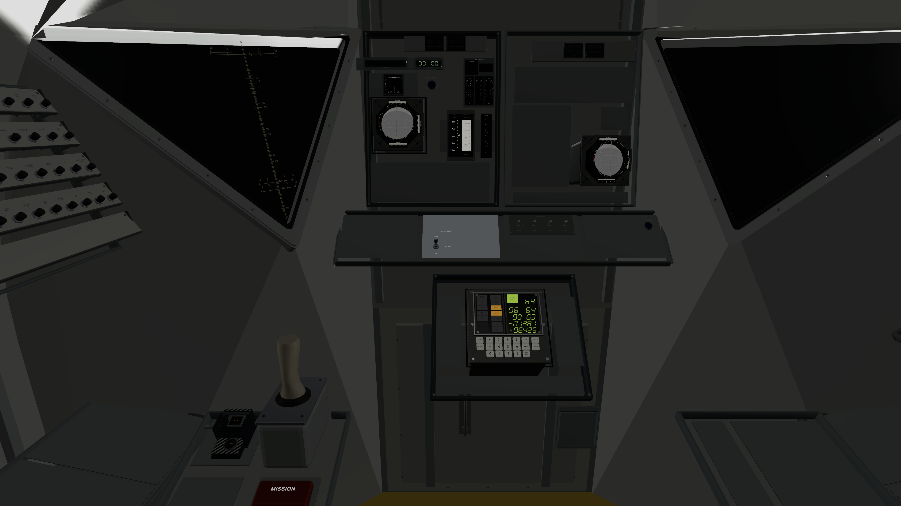
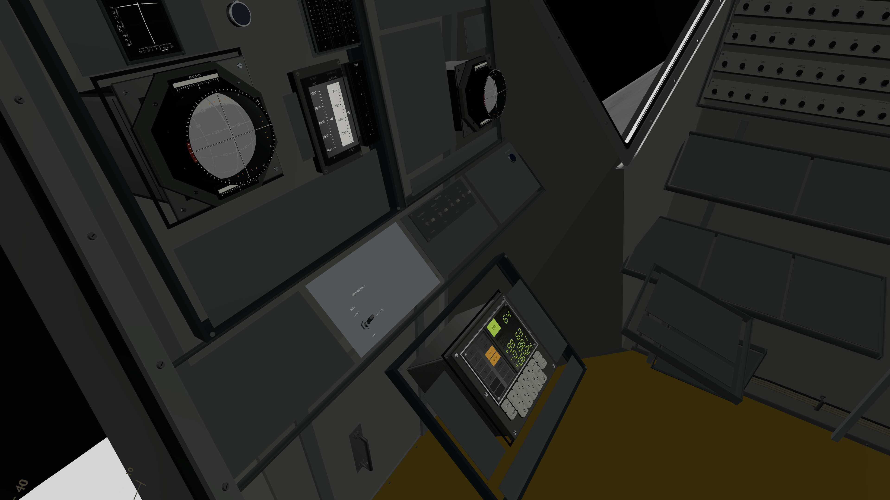
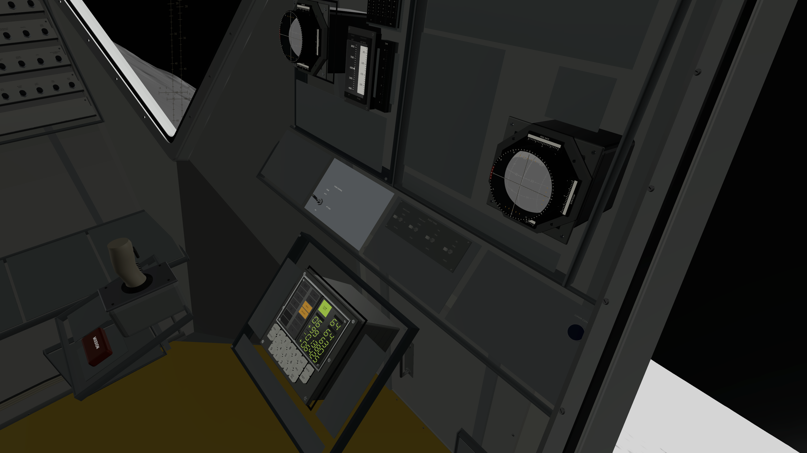
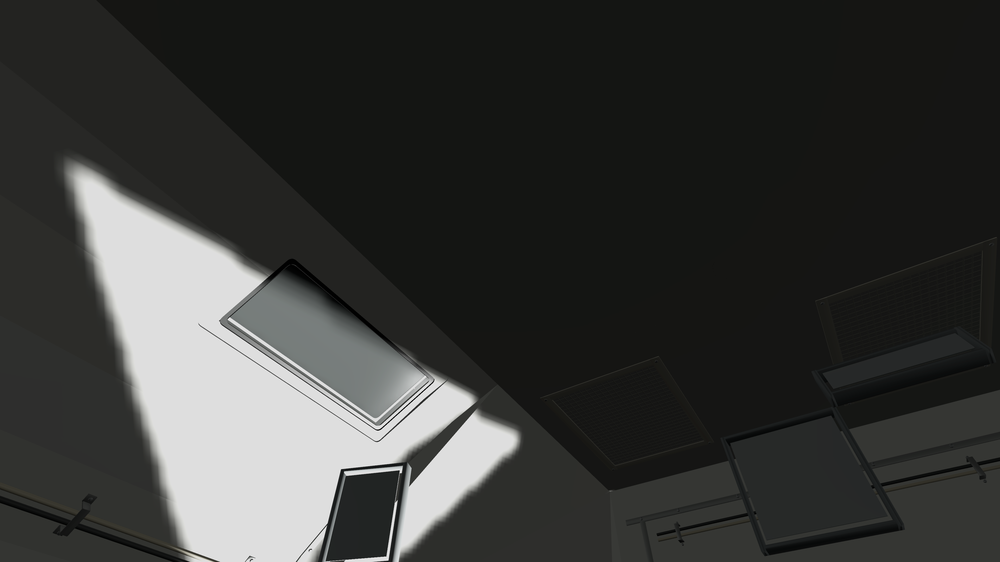
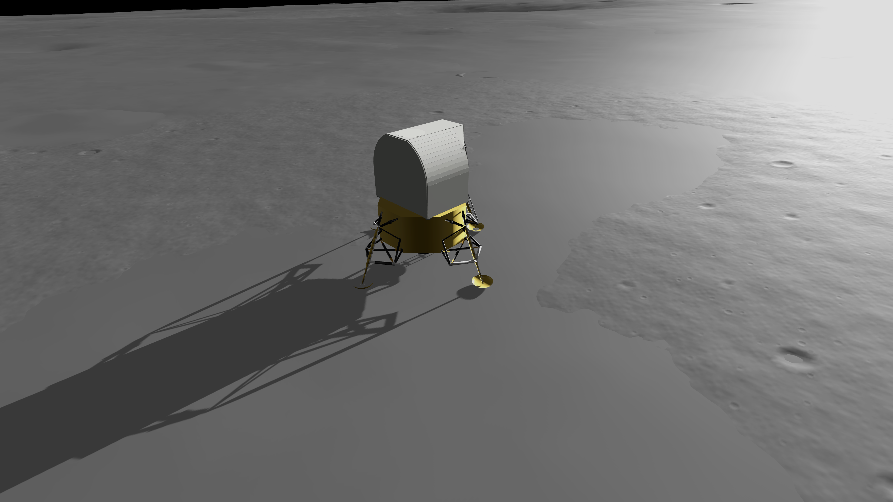
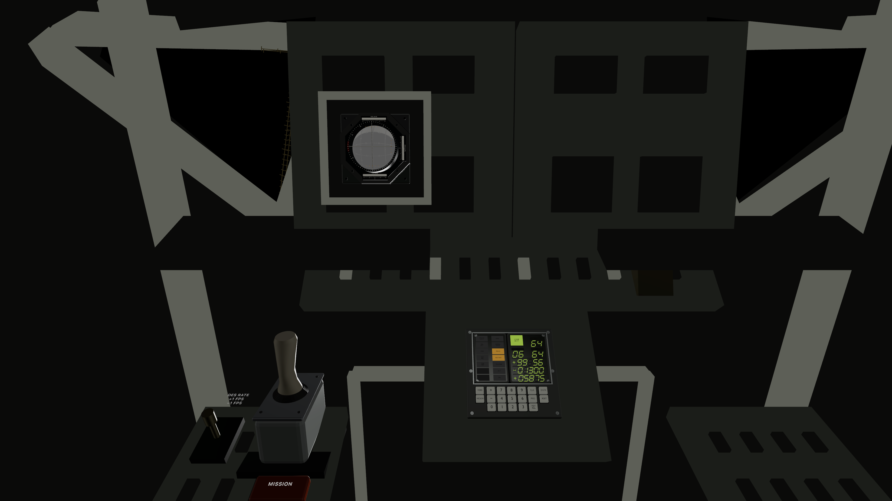

# Pilot station and systems acceptance

The combined cockpit regression passes **98 tests in 18 suites**, with zero failures or skipped tests, on visionOS 26.5 Simulator. Tested runtime source: `bdbf70f8b47f744c78dac7352477a6cd699754c5`; LMKit package: `d8c24dd5591bc8b874e643df65932ac863713832`; AGC/LMCore: `b3f15533db335ee882dc07401790c93010809e8f`. Coordinator publication adds merges and evidence without changing tested runtime code. Canonical LM terrain/LunarMap work is untouched.

## Installed behavior

- Two independent FDAI instances use the supported attitude source; pilot PGNS/AGS selection is not invented.
- Event readout and momentary controls support simulation-time count, start/stop/reset, direction and held digit adjustment. Pause, session/checkpoint restart, cancellation and replay availability are explicit. The later Apollo 13 countdown reversal is documented in [the event-state handoff](../../EventTimerStateHandoff.md).
- Mission-timer hardware is installed but blank: no verified mission epoch/preset exists in the current session. The blocked mission-control bank remains uninstalled.
- Engine buttons/guard coexist with DES RATE but remain inert without a crew engine-command API. Two contact lamps consume optional landing-gear probe state, distinct from pad contact. Host training status distinguishes missing probe data; power/test/stop-reset circuits remain unmodeled.
- Propulsion faces/needles/digits and two caution/warning arrays are installed neutrally. Pressures, quantities, historical T/W and CWEA/master-alarm behavior are not fabricated.
- Thirteen independently removable interior-detail groups add overhead liners/mesh, hatch fittings and cable runs. Planning labels reflect occupied and partial regions; Translation no longer incorrectly claims DES RATE is missing.

## White-ceiling correction

The user rejected the initial white roof, correctly. The imported assembly disabled shadow casting for its whole hierarchy, so the external sun illuminated inner surfaces through the pressure shell. Source and native materials were gray and nonemissive; repainting was not the solution.

The accepted runtime restores structural shell casting and fits a local shadow map to the enabled cabin/lander bounds, including a bounded near-ground receiver envelope. This removes broad washout and coarse shadow bands while preserving solar intensity and direction. Bounds work before anchoring and update correctly around Apollo/global terrain transforms and installation. Invalid fits restore the original light position and automatic policy. [Investigation, exact source values and controlled diagnostics](CeilingLighting/README.md) · [Runtime policy](../../CockpitShadowHandoff.md).

The final overhead capture shows shaded roof surfaces with a localized direct-sun patch. Actual final approach at approximately 6.9 m shows a continuous lander/gear shadow on terrain. **Coverage is local**: distant terrain/rock shadows outside the fitted footprint are not represented. Small legends and gray FDAI faces remain subdued, and interior lighting/material fidelity needs further work. No physical Vision Pro, stereo, gaze/pinch or reach acceptance is claimed.

## Verification

[Final test summary](final-bdbf70f-summary.json), [test log](final-bdbf70f.log) and [exact source manifest](shadow-final-source-manifest.json) are committed here. The raw result bundle remains `/private/tmp/lm-systems-validation/evidence/final-bdbf70f.xcresult`. The earlier 90-test result applies to the pre-shadow-correction source `82a21da`; its files are retained as superseded evidence, not the final lighting acceptance.

Native tests cover both FDAIs, materials/planning, event-state/control lifecycle, optional probe states, engine/DES RATE coexistence and retries, unavailable indications, assembly fallbacks, shadow math/coordinate invariance, global and Apollo loading continuity, and invalid-fit recovery. Initial failures exposed numeric JSON decoding and stale test assumptions; a subsequent focused run passed. Shadow checks additionally found invalid pre-anchor bounds, which were corrected before this final run.

LMKit separately passes 13 native package test functions, including two parameterized functions with 14 asset cases each and byte-identical packaging receipts. Its combined geometry review checks 153 component pairs and 61 named face/grip sightlines, with no new-component crossings or blocked sampled rays. Fourteen rear/backing mesh intersections remain documented and mechanically unqualified. Model provenance and all source qualifications are in LMKit `Provenance/pilot-systems-acceptance.json`.

Per-launch installation reports accompany the selected native images. Normal reports confirm both FDAIs, both timer roots, event controls, engine/DES RATE, both contacts, propulsion, warnings and all 13 detail groups; fallback explicitly reports the optional systems absent. Mission controls remain absent in every mode. Shadow reports retain actual fitted bounds, light state and altitude.

## Final native gallery

All selected views below are from the tested `bdbf70f` runtime. Exterior is a diagnostic camera outside the cabin and verifies shadows only; the exterior remains a provisional model.

### Front, normal

### Commander station

### Pilot station

### Corrected ceiling at a paused P64 checkpoint

### Actual final-approach ground shadow

### Optional planning labels

### Procedural fallback

